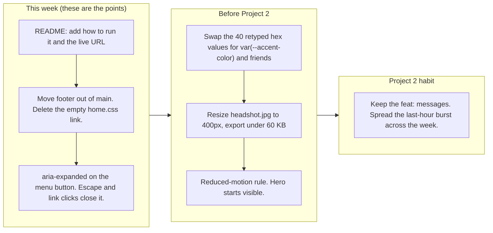

# Project 1: Static Foundations. Feedback for Hamzah Marie

**Student:** Hamzah Marie · **Course:** CSC 436, Fall 2026 · **Reviewed at commit:** [`1fa0296`](https://github.com/HamzahM03/CSC-436-Project1/commit/1fa029626f0fc55bb50134273da38e7af132a518)
**Repo:** https://github.com/HamzahM03/CSC-436-Project1 · **Live:** https://starlit-swan-32a6ca.netlify.app/

> **How this review was made.** Your instructor reviewed this project with Claude (Anthropic's AI) as a second set of eyes. Claude cloned the repo, read every line of the HTML, all eight stylesheets and both scripts, loaded the live site at phone, tablet and desktop widths, ran the W3C validator, opened and closed the hamburger, scrolled to check the About fade-in, downloaded the resume, measured every image, counted how many times each color is typed, and read the commit history. Every note and every point below was read and approved by your instructor. Same rubric, same standard, just more time spent looking at your code than one person has in a grading week.

## Grade: 88 / 100

| Category | Points | Earned | One line |
|---|---|---|---|
| Semantic HTML | 20 | **18** | Valid, one h1, clean outline, every element the brief lists; footer sits inside main, menu button has no aria-expanded |
| CSS layout | 25 | **22** | Flexbox and Grid, both authored, both purposeful, mobile-first; tokens defined then ignored, an empty stylesheet still linked |
| Responsive design | 15 | **15** | Seven min-width queries, no horizontal scroll anywhere, hamburger works, grids step 1 to 2 to 4 |
| JavaScript interaction | 15 | **13** | Menu toggle and an IntersectionObserver reveal, both working; the toggle announces nothing, the reveal covers one section |
| Repository and deployment | 15 | **12** | Fifteen commits over eight days with real messages, deploy matches repo; README has two of the four items |
| Content and polish | 10 | **8** | Real internships, real projects, real resume; a 553 KB headshot shown at 200 px, and a hero that depends on its animation |
| **Total** | **100** | **88** | Tied for the top of the class. The deductions are all small and all fixable in an evening. |

## The short version

This is a real portfolio, not an assignment that looks like one. The internships have dates and specific bullets, the projects link to their repos and a live demo, the resume downloads, and the whole thing reads like you. Underneath it the structure is what the brief asked for: header and nav with a list, main with six sections, articles for the cards, one h1, and a validator with nothing to say. All seven media queries are `min-width`, so you built mobile-first, which most of the class did not. Flexbox handles the nav, hero and project rows; Grid handles experience and skills, and the featured internship spanning both columns with `grid-column: 1 / -1` is exactly the kind of Grid move that shows you understand it.

The points came off in four small places. The README is a title and one sentence, so a stranger cannot run it or find it. The footer is inside `<main>`. You wrote five custom properties in `:root` and then typed the same hex colors by hand forty times across eight files. And the menu button opens and closes but never tells assistive tech which state it is in. None of those is a design problem. They are finishing problems, and the fix list at the bottom is short.

## What the numbers looked like

| Check | Result |
|---|---|
| Horizontal scroll at 375 / 768 / 919 / 1280 px | None at any width |
| W3C HTML validator | 0 errors, 0 warnings |
| Heading order | h1 > h2 > h3, no skipped levels |
| Semantic elements | header, nav (ul of 5), main, 6 section, 5 article, footer (inside main) |
| Media queries | 7, all min-width (mobile-first) |
| Experience grid columns at 375 / 768 | 1 / 2, featured card spans both |
| Skills grid columns at 375 / 600 / 900 | 1 / 2 / 4 |
| Hamburger | Opens and closes; no aria-expanded before or after |
| About fade-in | Fires on scroll: opacity 0 to 1, `is-visible` added |
| Console errors | 0 |
| Stylesheets linked | 9; `home.css` is empty |
| Custom properties | 5 defined, used 4 times; `#3ecf8e` typed 14 times in 8 files, `#111a2b` 9 times in 8 |
| Images | headshot.jpg is 3024 by 3069 and 553 KB, shown at 160 to 200 px; everything else is small; 0.73 MB total |
| Resume PDF | Downloads (HTTP 200) |
| Commits | 15, Sep 8 to Sep 15; 8 of them between 22:55 and 23:51 on the due date; last one at 23:51, on time |
| README | Title and one sentence; no run instructions, no live URL (2 of 4) |

---

## Semantic HTML: 18 / 20

### What's working

- The skeleton is right. `<header>` > `<nav>` with a `<ul>` of five links, `<main>` with six `<section>`s, an `<article>` per internship and per project, and `<footer>`. One `h1` in the hero, an `h2` per section, `h3` per card. The validator returns nothing.
- Every image has alt text that says what it is. The social icons are decorative (`alt=""`) with an `aria-label` on the link, which is the correct pattern: [index.html#L105-L129](https://github.com/HamzahM03/CSC-436-Project1/blob/1fa029626f0fc55bb50134273da38e7af132a518/index.html#L105-L129).
- The resume button uses the `download` attribute, and the nav links are real anchors to real ids, so the page works with JavaScript off.

### What to change

- **The footer is inside `<main>`** ([index.html#L450-L454](https://github.com/HamzahM03/CSC-436-Project1/blob/1fa029626f0fc55bb50134273da38e7af132a518/index.html#L450-L454)). `<main>` is the unique content of the page; the footer is site chrome, a sibling of `<header>` and `<main>`, not a child. Move `</main>` above line 450. Nothing in your CSS breaks.
- **The menu button has no state** ([index.html#L39-L44](https://github.com/HamzahM03/CSC-436-Project1/blob/1fa029626f0fc55bb50134273da38e7af132a518/index.html#L39-L44)). `aria-label="Toggle navigation"` is good. But a screen reader user hears "Toggle navigation, button" and has no idea whether it is open. Add `aria-expanded="false"` and `aria-controls="primary-nav"` (and give the `.nav-links` div that id). Then flip `aria-expanded` in `nav.js`. Two attributes, one line of JS.
- Small: the skill groups are `<div class="skill-group">` with an `h3` inside ([index.html#L259](https://github.com/HamzahM03/CSC-436-Project1/blob/1fa029626f0fc55bb50134273da38e7af132a518/index.html#L259)). They would be `<section>` or `<article>` if you want them to show up in the outline, but `div` is not wrong here.

## CSS layout: 22 / 25

### What's working

- **Flexbox and Grid, both yours, both used for the right thing.** Flex for the nav bar, the hero column, the button row and the project rows (17 flex containers). Grid for the experience cards and the skills grid. The experience grid goes from one column to two at 768 px and the featured card spans both with `grid-column: 1 / -1` ([experience.css#L108-L113](https://github.com/HamzahM03/CSC-436-Project1/blob/1fa029626f0fc55bb50134273da38e7af132a518/static/styles/experience.css#L108-L113)). Skills goes 1 to 2 to 4 ([skills.css#L68-L87](https://github.com/HamzahM03/CSC-436-Project1/blob/1fa029626f0fc55bb50134273da38e7af132a518/static/styles/skills.css#L68-L87)).
- **Mobile-first.** Every one of the seven queries is `min-width`. The base rules are the phone. That is what the brief asked for and almost nobody did it.
- One stylesheet per section is a reasonable way to keep 800 lines readable, and the hover and transition work on the cards is consistent. Zero `!important`.

### What to change

- **You wrote the tokens and then did not use them** ([global.css#L1-L5](https://github.com/HamzahM03/CSC-436-Project1/blob/1fa029626f0fc55bb50134273da38e7af132a518/static/styles/global.css#L1-L5)). `--accent-color: #3ecf8e` is defined once and used three times in `nav.css`. The literal `#3ecf8e` is typed fourteen more times across all eight files. `#111a2b` (your `--surface-color`) is typed nine times. `#cbd5e1`, `#334155`, `#1f2a3a` have no token at all and appear seventeen times between them. A find-and-replace to `var(--accent-color)` and friends takes ten minutes and makes the palette one edit instead of forty.

  ```mermaid
  flowchart LR
    subgraph now["Today: change the accent green"]
      direction TB
      N0["Edit --accent-color in global.css line 4"] --> N1["Then hunt for #35;3ecf8e by hand in hero, about, experience, skills, projects, contact, nav and global"]
      N1 --> N2["14 more edits across 8 files. Miss one and the site has two greens."]
    end
    subgraph after["After every rule says var(--accent-color)"]
      direction TB
      A0["Edit --accent-color in global.css line 4"] --> A1["Done. One edit, whole site."]
    end
    now --> after
  ```

- **`home.css` is empty and still linked** ([index.html#L8](https://github.com/HamzahM03/CSC-436-Project1/blob/1fa029626f0fc55bb50134273da38e7af132a518/index.html#L8)). It is left over from the rename. Delete the file and the link. Nine stylesheet requests is also on the high side for a one-page site; it is fine for a class project, but know that a build step would concatenate them in Project 2.
- **The hero is `min-height: 100vh` and a single centered column at every width** ([hero.css#L19](https://github.com/HamzahM03/CSC-436-Project1/blob/1fa029626f0fc55bb50134273da38e7af132a518/static/styles/hero.css#L19)). On a phone that is right. On a 1280 px desktop the content is a narrow column in the middle of a large navy rectangle, and About always starts below the fold. Either let the hero go two-column at 900 px (headshot beside the text, like the project rows already do) or drop to `min-height: 70vh`.

## Responsive design: 15 / 15

### What's working

- No horizontal scroll at 375, 768, 919 or 1280. The hamburger appears below 768 and the list appears above it ([nav.css#L104-L118](https://github.com/HamzahM03/CSC-436-Project1/blob/1fa029626f0fc55bb50134273da38e7af132a518/static/styles/nav.css#L104-L118)). Project rows stack on the phone and go image-beside-text on the tablet. Experience goes 1 to 2, skills go 1 to 2 to 4. Every breakpoint does something visible and none of them break anything. Full marks.

### What to change

- Nothing that costs points. The hero note above is a desktop layout suggestion, not a responsive bug.

## JavaScript interaction: 13 / 15

### What's working

- **Two scripts, both small, both working.** `nav.js` toggles `is-open` on the links and the button ([nav.js#L5-L8](https://github.com/HamzahM03/CSC-436-Project1/blob/1fa029626f0fc55bb50134273da38e7af132a518/static/js/nav.js#L5-L8)), and the CSS turns the three spans into an X. `scrollEffect.js` uses an IntersectionObserver at 20 percent to add `is-visible` to About ([scrollEffect.js#L3-L16](https://github.com/HamzahM03/CSC-436-Project1/blob/1fa029626f0fc55bb50134273da38e7af132a518/static/js/scrollEffect.js#L3-L16)), and the CSS transitions it in ([about.css#L7-L16](https://github.com/HamzahM03/CSC-436-Project1/blob/1fa029626f0fc55bb50134273da38e7af132a518/static/styles/about.css#L7-L16)). Claude scrolled to it and watched the class land and the opacity climb. IntersectionObserver instead of a scroll listener is the right choice and most students do not know it exists. Zero console errors.

### What to change

- **The toggle changes nothing a screen reader can hear.** Add `menuButton.setAttribute('aria-expanded', navLinks.classList.contains('is-open'))` inside the click handler. Then close the menu when a link is clicked (right now on a phone you tap "About", the page scrolls, and the open menu is still covering it) and on Escape. That is about six more lines and the menu is finished.
- **The reveal only watches About.** `querySelector(".about")` observes one element. The other four sections just appear. Either observe all of them (`querySelectorAll("main > section")` and a `.reveal` class) or take the effect off entirely; one section animating in and the rest not reads as unfinished. Also call `observer.unobserve(entry.target)` after adding the class so the observer stops doing work it no longer needs.
- Small: `menuButton` and `aboutSection` are queried once with no null check. Fine on this page, but the first time you reuse `nav.js` on a page without a button it will throw on line 5.

## Repository and deployment: 12 / 15

### What's working

- **The history shows the build.** Fifteen commits from Sep 8 to Sep 15: navbar first, then mobile nav, then hero, then the reveal, then each section. Messages like "feat: add responsive mobile navigation" and "feat: add experience section with responsive grid" say what changed and why. This is the second-best history in the class. `.gitignore` covers `.env`, `.DS_Store` and editor folders. The live site matches the repo exactly and needs no login.
- One honest note, not a deduction: eight of the fifteen commits landed between 22:55 and 23:51 on the due date. You started a week early, so this is not a last-minute dump, but half the page went in during the last hour. Next time move that burst to the weekend.

### What to change

- **README is two lines** ([README.md#L1-L2](https://github.com/HamzahM03/CSC-436-Project1/blob/1fa029626f0fc55bb50134273da38e7af132a518/README.md#L1-L2)). The brief asks for a title, a description, how to run it locally, and the live URL. You have the first two. Add "Open `index.html` in a browser, or run `npx serve .`" and the Netlify link. Five minutes, three points.
- Small: "deleted home.html" and "Rename home page to index" are two commits for one rename. `git mv home.html index.html` does it in one and keeps the file's history attached.

## Content and polish: 8 / 10

### What's working

- It is a real portfolio. Two internships with dates, specific bullet points and tech tags, a current role, two projects with repo links and a live demo, a resume that downloads, a headshot, and a logo you made. The dark navy and green palette is consistent from the nav to the footer, and the hover states on the cards are tight. If a recruiter landed here they would not know it was a class project.

### What to change

- **The headshot is 3024 by 3069 pixels and 553 KB, shown at 200 px** ([index.html#L63](https://github.com/HamzahM03/CSC-436-Project1/blob/1fa029626f0fc55bb50134273da38e7af132a518/index.html#L63)). It is 75 percent of everything the page downloads. Export it at 400 px wide (2x for retina) as JPEG or WebP and it drops under 60 KB.
- **The hero depends on its animation to be visible** ([hero.css#L27-L32](https://github.com/HamzahM03/CSC-436-Project1/blob/1fa029626f0fc55bb50134273da38e7af132a518/static/styles/hero.css#L27-L32)). Every hero element starts at `opacity: 0` and the keyframe brings it to 1. Today nothing stops the keyframe, so it works. But the day you add a `prefers-reduced-motion` rule (and you should, it is one media query), the hero goes blank for anyone who has that setting on. Start at `opacity: 1` and put the `opacity: 0` plus the animation inside `@media (prefers-reduced-motion: no-preference)`. The effect stays for everyone who wants it and the content is never hostage to it.

  ```mermaid
  flowchart TB
    S["Page loads. Hero image, h1, tagline and buttons all start at opacity: 0 (hero.css line 27)"]
    S --> Q{"Does the reveal keyframe run?"}
    Q -- "Today: nothing stops it" --> OK["Content fades in over 1.7 seconds. Looks great."]
    Q -- "The day you add a reduced-motion rule, or print the page" --> BAD["Hero stays invisible. Empty navy screen, no name, no buttons."]
    BAD --> FIX["Fix: start at opacity 1. Put opacity: 0 and the animation inside @media (prefers-reduced-motion: no-preference)"]
  ```

- Small: the 1.7 second stagger on the hero is a long time to wait for a name and two buttons. 0.9 seconds total would feel the same and cost less patience.

---

## Your next three moves



1. **Finish the README and move the footer.** Two items in the README, one closing tag moved, one dead link deleted. Twenty minutes, and it covers most of what came off.
2. **Give the menu a state.** `aria-expanded`, close on link click, close on Escape. The menu goes from working to finished.
3. **Use the tokens you wrote, and shrink the headshot.** Find-and-replace the hex values, export the photo at 400 px. Then add the reduced-motion query so the hero never depends on its animation.

*This review lives in a pull request on your repo. It only adds files under `feedback/` and does not touch your code. Merge it, close it, or just read it. Questions go to office hours or the Brightspace board. This is a strong site, Hamzah. Finish the edges and it is a portfolio you can send out.*
